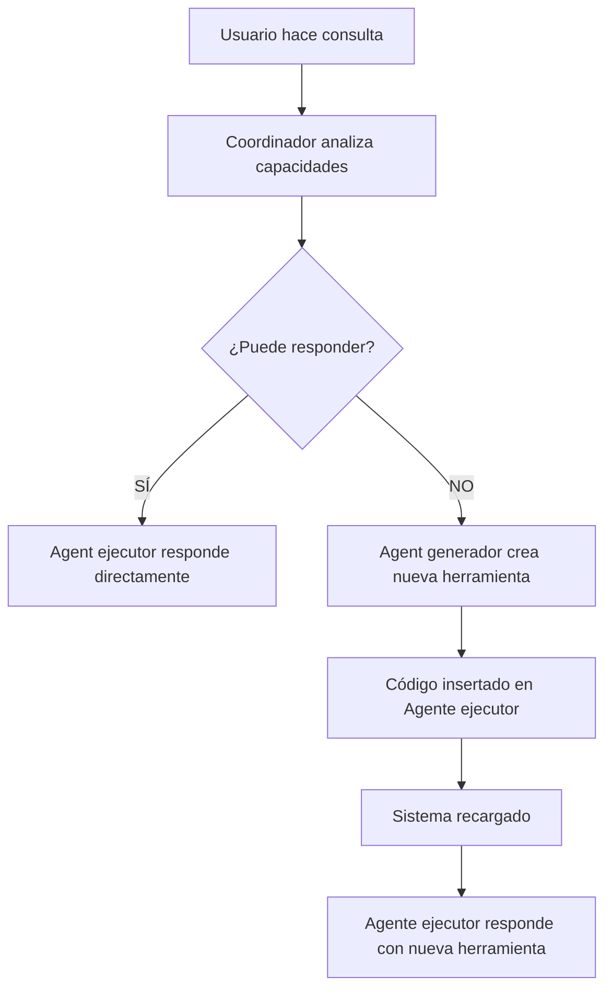

# 🎯 Desafío Técnico: Sistema de Agentes LDAP Auto-Adaptativos

## 📋 Descripción del Desafío

**Bienvenido al challenge técnico del equipo de Offensive Security de Mercado Libre.**

El desafío es diseñar e implementar un **sistema de agentico de IA** que pueda interactuar dinámicamente con un servidor **OpenLDAP**, y que tenga la capacidad de realizar consultas sobre el dominio. Es deseable (no obligatorio) añadirle la capacidad de **auto-expandir sus funcionalidades** cuando encuentre consultas que no puede responder. No te preocupes si no conoces todas las herramientas avanzadas o no incorporas algunas funcionalidades, nos interesa más tu razonamiento y enfoque.

### 🎯 Objetivos del Desafío

1. **Encontrar la API-KEY**: Para utilizar IA debes encontrar la API key en este repositorio.
2. **Integración con IA**: Usar modelos de lenguaje para análisis y generación de código (Gemini).
3. **Conectividad LDAP**: Implementar un agente que pueda conectarse e interactuar con un servidor OpenLDAP.
4. **Capacidades Base**: Desarrollar herramientas básicas para consultas comunes de AD.
5. **Auto-Expansión (Deseable)**: Diseñar un mecanismo donde el sistema pueda generar nuevas herramientas automáticamente.
6. **Arquitectura Multi-Agente (Deseable)**: Coordinar diferentes agentes especializados.

## 🏗️ Arquitectura Esperada

### Componentes Requeridos
Puedes implementar más o menos agentes para solucionar este challenge, esto es solo una sugerencia.

```
Sistema Mono-Agente
├── 🤖 Agente Ejecutor / Generador
```

```
Sistema Multi-Agente
├── 🤖 Agente Ejecutor
├── 🧠 Agente Generador
└── 🎛️ Coordinador Central
```

### 🔄 Flujo de Trabajo Deseado

```
Usuario → Consulta → ¿Existe herramienta? → NO → Agente genera código → Actualiza Agente  → Responde consulta → FIN
                        ↓
                        SÍ → Agente responde directamente → FIN
```


## 🛠️ Especificaciones Técnicas

### Stack Tecnológico Sugerido

- **🐍 Lenguaje**: Python
- **🤖 Framework IA**: LangChain + LangGraph
- **🧠 Modelo**: Google Gemini 2.0 Flash. (Ten en cuenta que el prompt es MUY importante)
- **📁 LDAP**: Hacer uso de alguna librería o desarrollar la funcionalidad.
- **📦 Gestión**: Poetry para dependencias
- **🐳 Infraestructura**: Ya proporcionada con Docker + Docker Compose


## 🐳 Infraestructura LDAP Proporcionada

### Entorno de Prueba

Se proporciona un entorno completo de OpenLDAP con:

- **Dominio**: `meli.com` (Base DN: `dc=meli,dc=com`)
- **Servidor**: `ldap://localhost:389`
- **Admin**: `cn=admin,dc=meli,dc=com` / Password: `itachi`
- **Web UI**: `http://localhost:8080` (phpLDAPAdmin)

### Configuración Automática

```bash
cd open_ldap_files
./setup-ldap.sh
```

## 📚 Funcionalidades Requeridas

**Funcionalidades core:**

1. **Análisis de Capacidades**: Evaluar si el agente ejecutor puede responder y dar respuesta
2. **Gestión de Estado**: Mantener registro de herramientas disponibles

**Funcionalidades deseadas:**

3. **Enrutamiento Inteligente**: Decidir usar herramientas existentes o crear nuevas.
4. **Verificación del código**: Inserción limpia de código sin romper archivos existentes.
5. **Sistema de Reset**: Restaurar agente a estado original
6. **Logging**: Para realizar un manejo de errores y timeouts

**Herramientas base que deben implementar (obligatorio):**

1. `get_current_user_info()` - Información del usuario actual
2. `get_user_groups(username)` - Grupos de un usuario específico
3. Incorpora las nuevas herramientas que te parezcan relevantes teniendo en cuenta el contexto de un **equipo de seguridad ofensiva** (maximo de 6 más).

## 🎯 Ejemplos de Casos de Uso

### Nivel 1: Funcionalidad Base
```
- "¿quién soy?" (herramienta existente)
- "¿qué grupos tengo?" (herramienta existente)
```

### Nivel 2: Auto-Expansión con foco ofensivo 
```
- "¿cuál es el nombre de todos los grupos?" (debe auto-generar herramienta)
- etc ...
```

## 📊 Criterios de Evaluación

### Entregable
- ✅ Repositorio de Github con el Agente
- ✅ Uso de Poetry para el manejo de dependencias

### Funcionalidad
- ✅ Conectividad exitosa con OpenLDAP
- ✅ Implementación de herramientas base

### Extra
- ✅ Auto-generación de herramientas funcionales
- ✅ Hacer reset para volver a las funciones originales
- ✅ Coordinación correcta entre agentes

### Calidad de Código
- ✅ Arquitectura limpia y mantenible
- ✅ Uso apropiado de patrones de diseño

### Extra
- ✅ Manejo robusto de errores
- ✅ Código auto-generado sintácticamente correcto
- ✅ Tests unitarios para agentes o código auto-generado

### Innovación Técnica
- ✅ Creatividad en la implementación
- ✅ Uso de IA generativa

### Cualidades ofensivas
- ✅ Incorporación herramientas con enfoque ofensivo
- ✅ Justificación del por qué

### Documentación
- ✅ Ejemplos de uso

### Extra
- ✅ README o documento técnico completo

---

## 📞 Recursos de Ayuda

- **Documentación OpenLDAP**: https://www.openldap.org/doc/
- **LangChain Tools**: https://python.langchain.com/docs/how_to/custom_tools
- **Gemini API-KEY Documentacion**: https://ai.google.dev/gemini-api/docs?hl=es-419
- **¡Éxitos y que tengas suerte con el desafío! 🚀**

---
*Desafío técnico para nuevo integrante del equipo de Seguridad Ofensiva - Mercado Libre* 